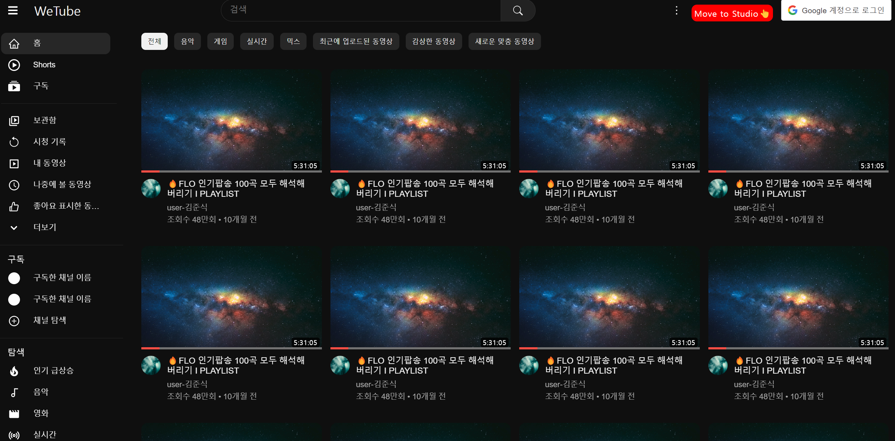
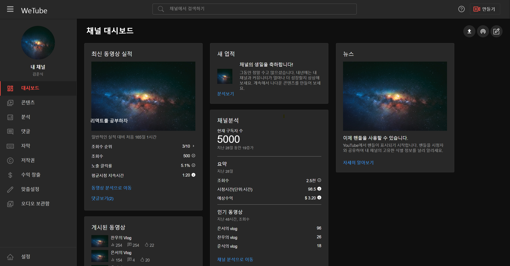
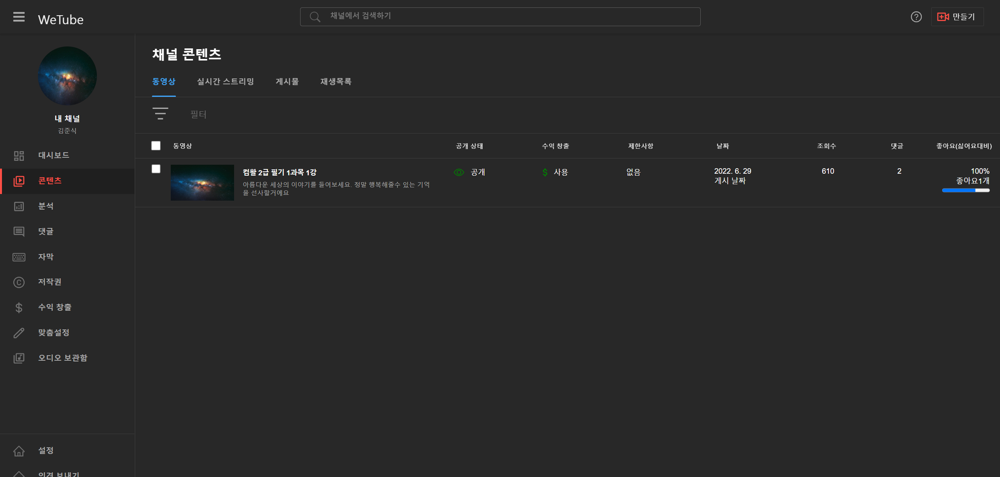
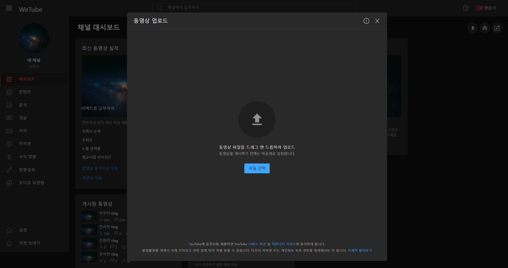

# Youtube Clone 웹 with 현업자와의 협업

## 🔥깨지더라도 포기하지 말고 물어보고 배우자!
### `주요역할`
- STUDIO Page Layout 및 api 작업
- 모르는거 열심히 물어보기....!!!!!!!!!
- 솔직히 기여도... 쓰지않겠다. <br/> 기여한게 없어서가 아니라 오프라인으로 만나 수 없이 질문하고 피드백하면서 코드를 고쳤다.. <br/>팀원들의 기여도가 가장 크다. 감사합니다!

<h3> 배포링크 보러가기 🔍 https://chanwoo-jeong.github.io/Wetube/</h3>

## 📌 프로젝트 설명
### `진행 동기` 
 - 비전공자의 슬픔은 다름아닌 프로젝트 인원 구하기....
 - 그동안 열심히 공부한 React 및 코딩을 협업을 통해 무엇을 만들어보고 싶었다.
 - 그러던 도중 캠픽 커뮤니티에서 주니어 개발자님들이 주도하는 Youtube 클론코딩을 보았다.
 - 실력이 부족하다고 생각했지만 깨지면서 배워보자라는 마음으로 지원!!!
 - 역시 실력이 제일 부족했지만 오히려 배울 수 있어 좋았다!

### `진행 기간` 
 - ⏰ 기간 : 2022.12 - 2023.02 

### `사용기술`
- React , SCSS , Hook
- React-Icons 라이브러리 사용

### `클론이지만... 현업자들로부터 동기부여를 받은 프로젝트이다!`
- 클론 프로젝트는 사실 프로젝트라고 할 수 없다...
- 하지만 이프로젝트는 부실한 나의 React실력으로 뛰어든 첫 시도였다.
- 원활한 협업을 위해 커밋 메시지 통일 하는 작업을 해보았지만 습관이 없어 잘되지 않았다..
- 현업자들과의 Github 협업을 통해 코드리뷰를 진행경험했지만 아는게 없어 잘할 수 없었다..
- 너무나 삐걱거린 클론협업프로젝트였기에 가장 아쉽고 민망했다.
- 🚀 그러나 포기하지 않았다. <br/>이 프로젝트의 기억으로 인해 더 열심히 꾸준히 포기하지 않기로 다짐했다. <br/>할 수 있다.
 
### `작업화면` 





### `성장한점`
- git & github 의 숙련도가 올라갔다. fork, clone, pr, 코드리뷰 능숙해졌다!
- Youtube 개발자도구를 보며 Elements를 분석하며 복잡한Layout에 익숙해져갔다.
- 삼항연산자보다 좋은 {{}}[] 문법 ([]속 상태에 따라 컴포넌트를 랜더링 할 수 있다.)
  ```javascript
    function Component() {
    
    const [mode , setMode] = useState("list")
    
    return (
        <div>
        {
            { 
            list : <Dashboard />,
            edit : <Contents />,
            }[mode]
        }
        </div>
    )
    }
  ```
- modal Potal 을 이용한 Upload 기능 구현
  ```javascript
     "기존의 리액트에서 컴포넌트를 렌더링 하게 될 때, 
     children 은 부모컴포넌트의 DOM 내부에 렌더링 되어야 했지만 
     Portals 를 사용하면 DOM 의 계층구조 시스템에 종속되지 않으면서 컴포넌트를 렌더링 할 수 있다."
   
     "modal 사용 시 다른 컴포넌트와 겹치거나 
     css속성인 z-index를 신경써야 한다는 문제점이 발생할 수 있다. 
     이러한 문제를 Portal을 통해 해결할 수 있다."

    //index.html 파일
    <body>
      <div id="root"></div>
      <div id="modal"></div>
    </body>

    //Portal.js 파일
    import reactDom from "react-dom";

    const ModalPortal = ({ children }) => {
    console.log(children)
    const el = document.getElementById("modal");
    return reactDom.createPortal(children, el);
    };

    export default ModalPortal;

    //사용할 모달 만들기 Upload.jsx 파일

    //사용하기
    <ModalPortal>
        <Upload modalOpen={modalOpen} setModalOpen={setModalOpen} />
    </ModalPortal>
  ```
  
